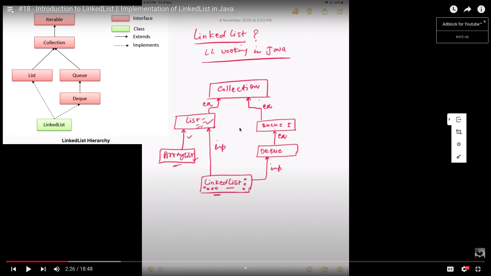
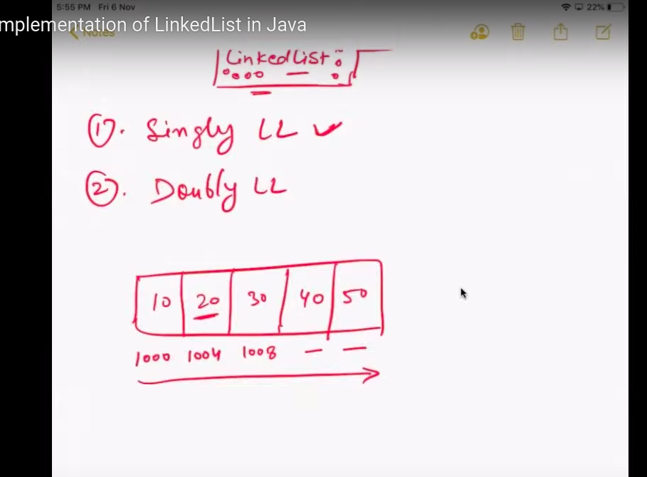

# Linked List

[geeks-for-geeks](https://www.geeksforgeeks.org/linked-list-in-java/)<br>
[video-source](https://www.youtube.com/watch?v=GuWfBcxES44&list=PLFGoYjJG_fqoDQHufg7XVk-yb2w6CNpgF&index=18&ab_channel=NaveenAutomationLabs)

* Linear Data structure
* elements are not stored in continuous locations
* every elements are **not stored in contiguous locations**
* each element is known as **Node**

### Advantage
* Dynamicity
* ease of insertions and deletions
* can be used as a list,stack or queue.

### Disadvantage
* Nodes cannot acces directly
* To access we need to start from the head and follow through the link to reach a node


Q1. What is the difference between ArrayList and LinkedList?
--

| ArrayList | Linked List |
| --- | ---|
| dynamic array | doubly linked list is by default set on the java collection | 
| slow | fast |
| act as a list | act as a list and queue |
| better for sorting and accessing data | better for manipulation |
| contiguous | not contiguous |
| default capacity 10 of assigned to the ArrayList | no default capacity |
| special feature resizable array | doubly Linked List |


in short :
* Linked List is a implementation of List Interface

* ArrayList is also a implementation of List Interface

* But Linked-List is also have the implementation of the Queue  and the Deque interface also..



so linked-list has the feature of the **queue** and **deque** also.

There are two types of Linked List
1. Singly Linked List
2. Doubly Linked List.

There are some other linked lists like circular linked list etc, but they are also derived from them. So mainly there are two types of linked list.

Singly Linked List:

arrays store the data in the continuous memory address.



### Advantage of LinkedList Details

Suppose we have an arry, nums = [10,20,30,40] <br>
Now we want to insert 15 between 20, 30. <br>
To do that, we have to do a shifting operation. and if we have to do a lot shifting operation in multiple times, it will take a long time which is not a good solution. <br> 

* as arrays have continous memory location,  for large scale of data, we have to solve this with Linked List

Singly Linked list maintains different nodes. Each nodes have two portions:

1. Data
2. Pointer (next pointer. pointing the next node. And the last nodes point none)

* First Node is called the Head of the LL
* Last Node is called the Tail of the LL
* We can store the data only on on forward direction only(singly linked list).

## Creation of Singly Linked List
```
public class MyLinkedList {

    Node head;

    class Node {

        int data;
        Node next;

        Node(int data) { // creation of a node
            this.data = data;
            next = null;
        }
    }

    public void printMyLinkedList() {

        Node n = head;
        while (n != null) {
            System.out.println(n.data);
            n = n.next;
        }
    }


    public static void main(String[] args) {
        MyLinkedList ll = new MyLinkedList();

        Node first = ll.new Node(10);
        System.out.println("first Node data: " + first.data);
        ll.head = first;

        Node second = ll.new Node(20);
        first.next = second;


        Node third = ll.new Node(30);
        second.next = third;


        ll.printMyLinkedList();
    }
}
```
### Creation of Nodes
```
class Node {
    int data;
    Node next;

    Node(int data) {
        this.data = data;
        next = null;
    }
}
```

### Features of LinkedList
* LL is a default class in Java
* it can be used as List, Queue, Stack
* It allows the null entry
* dynamic collection
* insertion and deletion can be easily implemented
* it is not synchronized(thread safe)
* in LL, manipulation is fast because we don't need shifting