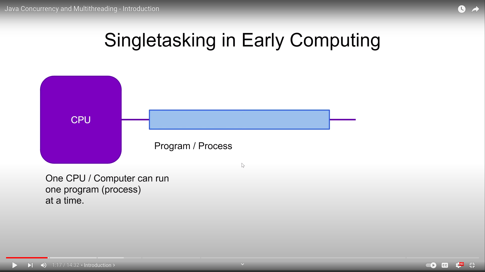
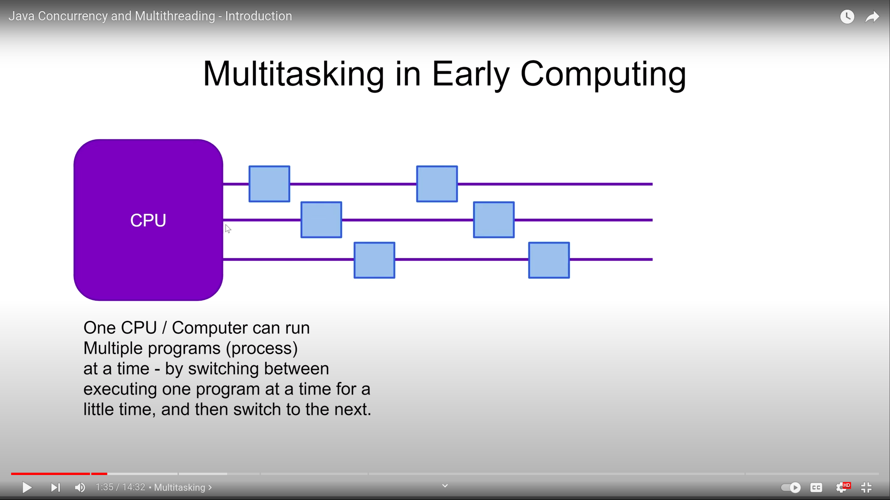
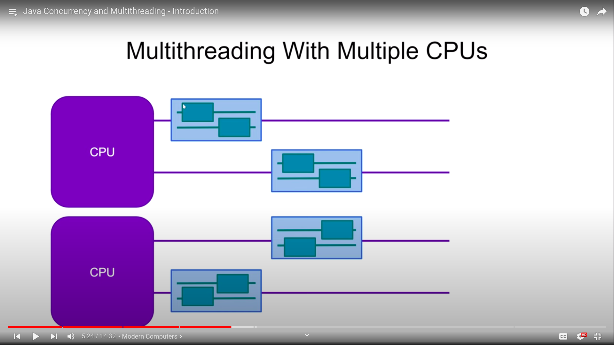

## Java Concurrency

[source](https://www.youtube.com/watch?v=mTGdtC9f4EU&list=PLL8woMHwr36EDxjUoCzboZjedsnhLP1j4&index=1&ab_channel=JakobJenkov)

### Innovation of Multitasking
In the early stage of computing, CPU can only run one single program at a time. Like we are working on word. now we have 
to close word and open excel then do the changes, and then close the excel and then reopen the word file and continue.

So parallel work is not possible in the early stage of CPU. To solve this, **multitasking** was arrived.

### How MultiTasking works
As CPU can only do one work at the same time, multitasking were arrived. A single task/application will do for some time,
and then switch for the other and then switch back. This switching time was so fast that the user cannot feel. This is 
what we call multitasking.

Actually CPU and OS do this work together. CPU runs the OS and OS does the task switching job.

Modern days CPU has some more features which makes easy for the OS.

### Multithreading
* Multitasking and MultiThreading are kind of same concepts excepts multithreading executes on the **same application**.

An Application can do the same task like file download and music play. This is done by multithreading.

Now it is also possible that each of the thread might execute on the same time. As there are multiple cpu/cores available,
different threads can run on the same time with different cpus.

Video editing, rendering simulation softwares or lots of PC games use a lot of multithreading.

#### Why Multithreading

Suppose a case appeared, where the CPU has to load some data in the middle of performing a task.
Now at the time of loading data cpu becomes idle. So, if we make CPU busy in this time, we can use the full cycle of the
CPU. At large scale which is very much significant.

* Better I/O utilization.
* Better CPU utilization.
* Higher application responsiveness. (Heavy long running task can be run in separate thread)