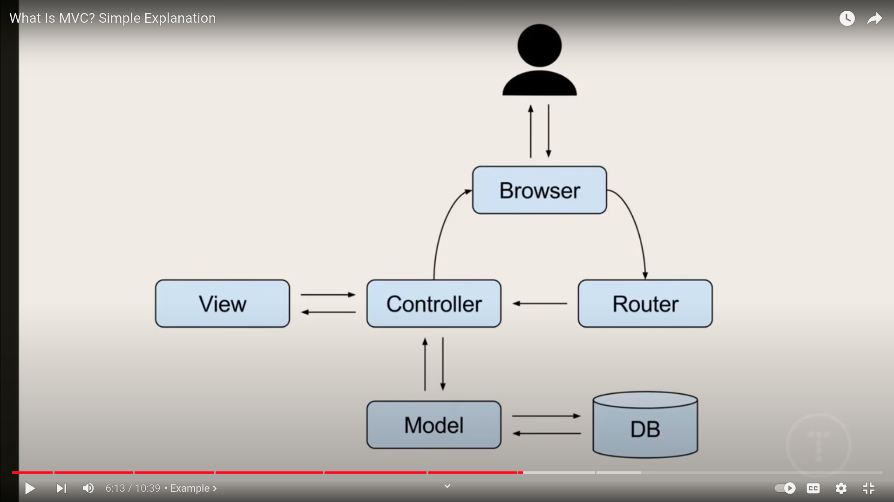
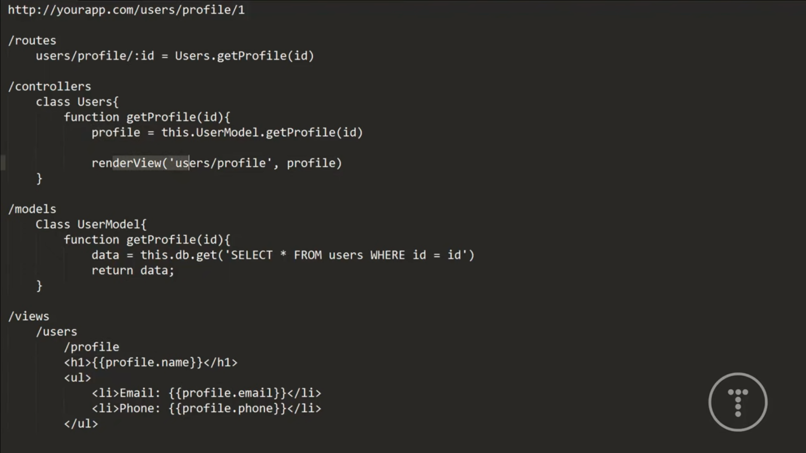

# MVC Pattern
[source](https://www.youtube.com/watch?v=pCvZtjoRq1I&ab_channel=TraversyMedia)

* Model View Controller
* Software Architectural design pattern mostly used in web development

## General Purpose / Main Target
* seperate functionality, logic, interface all kinds of things in the application

* allow multiple developers work on the same project.

## Model

* Model is responsible for getting/manipulating the datas
* It is the brain of the application
* interacts with the Database(relational, non-relational)
* communicates with the controller.
* on some frameworks model can directly updates the view.

## View

* What the end users sees (UI)
* usually consists of HTML/CSS
* communicates with the controller.
* can be passed **dynamic values** from the controller.
* template engine is the part of the view

template engine --> 
Sometimes we need to dynamically, shows different block in the page. With normal HTML code we can not do any kind of if statement. With the help of template engine we can do that. Example(Jinja)

## Controller

* takes user input.
* process requests (GET, POST, PUT, UPDATE)
* It takes data from model and then process it/or not then pass it to the view. Then the template engine renders those data and browsers show those rendered data.

## Psudocode
