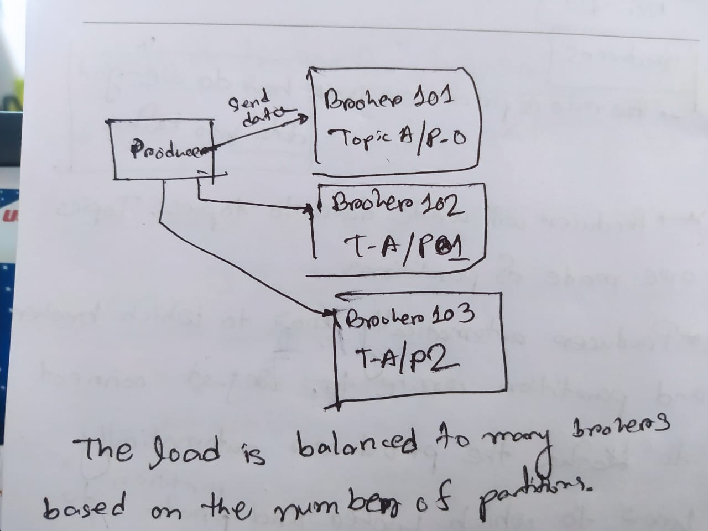

## Producers
The role of producer is to get/load the data in Kafka 
* Producer will write data to topics. Topics are made of paritions
* Producer automatically knows to which broker and partition to write to. We just connect to Kafka, the producer will automatically knows to which broker and partition to write to.
* In case of broker failure, Producers automatically recover.

    

This load is balanced by Kafka automatically.

### How Producer Can Write
Producer can choose to receive **acknowledgement**(confirmation) of data writes. There are 3 options:
* `acks=0` : producer won't wait for the acknowledgement(confirmation) that the data has been successfully sent to the partition. So, there is a possibility of data loss.
* `acks=1` :  producer will wait for **leader acknowledgement**. (limited data loss).
* `acks=all` : **Leader + replicas acknowledgement**. (no data loss)

## Message Keys (of producers)
* Producers can choose to send a key with the message (String, number etc.)
* If `key=null`, data is sent **round-robin** (broker 101, then 102, then 103..)
* If key is sent (`key=!null`), all message for that key will always go to the same partition.
* A key is basically sent, if we need ordering for a specific field. (eg: truck_id). Like: truck_id_123 data will always be partition 0. truck_id_234 data will be always partition 1. (randomly)
* _The mechanism of key to partition is called **key-Hashing**, which depends on number of partitions_
* We will not know that key is sent to which partition, but it will always be in the same partition. 