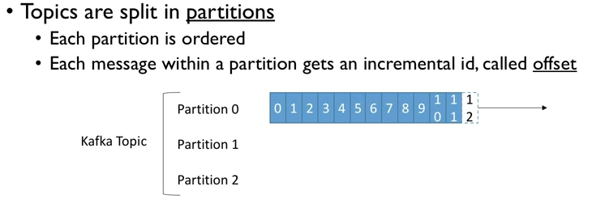
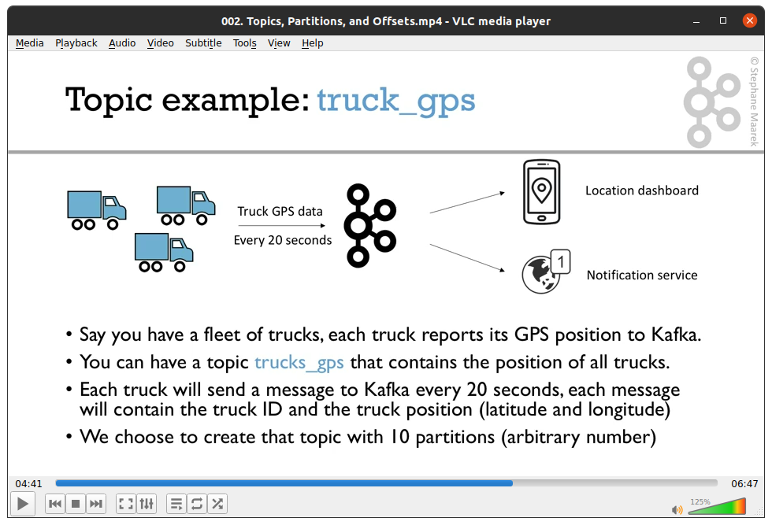
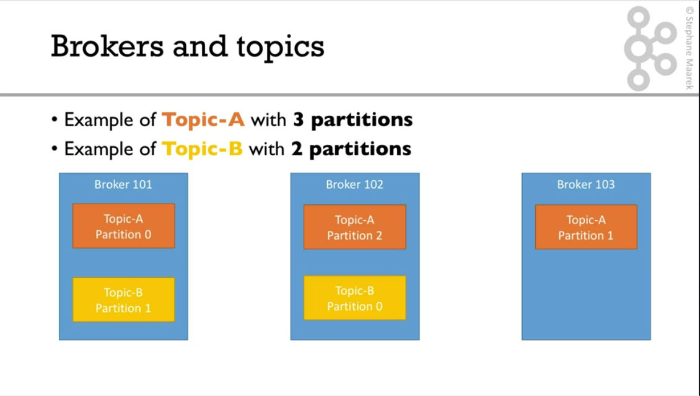
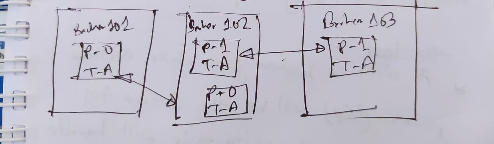
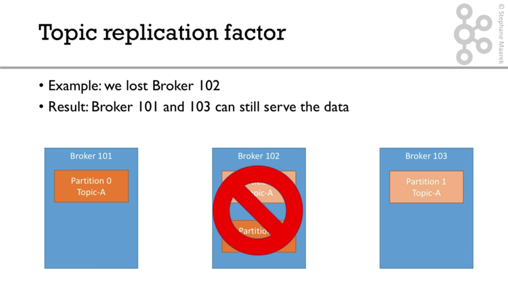

## Topics

* A particular stream of data
* Similar to a table in the database
* We can have as many topics as we want
* A topic is identified by its name.

## Partitions
* Topics are split into partitions
* Each partition is ordered
* When we create a topic we will set our partitions, we can change it later too. 

## Offset
* Each message within a partition gets an incremented id which is called "Offset"

## Example

## More info

* Offset only have a meaning for a specific partitions.
* Order is guranted within partition. (not across partitions)
* Data is kept only foor a limited time. (default 1 week)
* Once the data is written to a partition, it can't be changed (immutability)
* Data is assigned randomly to a partition unless a key is provided.

## Brokers (servers)
Brokers hold the topics. 

* Kafka cluster is composed of multiple brokers (servers).
* Each broker is identified with its ID
* Each broker contains certain topic-partitions. That means, some amount of data will be in each brokers. But not all as Kafka is distributed. 
* After connecting to any broker (called **Bootstrap broker**), you will be connected to entire cluster.
* Big clusters have over 100 brokers, but we can start with 3 (good number)

### Broker and Topics
The beauty of Kafka is:
**When we create  a topic, Kafka will automatically assigned the topic and distributed accross all the brokers**. 

*Data is distributed and Broker 103 doesn't have any Topic-B data.*

## Topic Replication Factor

When there is a distributed system in the big data world, we need to have replication so that if a machine goes down, others can take over that. **partition-Replication** does that for us in Kafka.

Suppose, we have 3 clusters on our system. When we create a topic, we need to decide an replication factor. 
* Topics should have a replcation factor > 1 (ususally between 2 & 3)
* If a broker is down, another broker can serve the data.
* Replication factor of N means, we have N copy of our data.

**If we lost Broker 102, Broker 101 and 103 will still serve the data.**

## Concept of Leader for a Partition

* At anytime only one broker can be a leader for a given partition.
* ONly that leader can receive and serve data for parition.
* The other brokers will synchronize the data
* Therefore each partition has one leader and multiple ISR (In sync replica)
* When a broker goes down another parition (ISR) will be the leader till the broker goes up again. If it is back then it will replicate the data and become the leader again. Kafka will handle this internally.
* The leader and ISR will be determined by **Zookeeper**