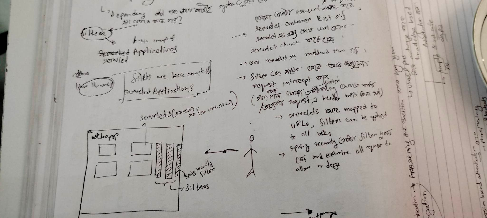

## Introduction
---
this video series is very much helpful [source](https://www.youtube.com/playlist?list=PLqq-6Pq4lTTYTEooakHchTGglSvkZAjnE)


We can think about Spring Security like the Guard of our Web App.
Spring Security is an application framework that helps us do application level security.
It gives the following features:
* Login/Logout
* Allow/block URLs to certain users(certain roles)
* Allow/block access to URLs to logged in users

Spring Security handles the most common vulnerabilites. If we include spring security to our webapp we can be saved from:
* Session fixation
* Click jacking
* Click Site Request Forgery (CSRF)

All these vulnerabilites are handled by Spring Security, so we don't need to give any focus to them and concentrate on the development.

### What Can We Do
* Username/password authentication
* SSO/Okta/LDAP --> single sign on stuff
* App level Authorization
* Intra App Authorization like OAuth
* Microservice security (using tokens, JWT)
* Method Level Security

## 5 core Concepts
1. Authentication
2. Authorization
3. Principal
4. Granted Authority
5. Roles

We can think the Spring security like the guard of our web app. So, All the works that a guard do to protect his house, are same to spring security's feature.
### 1. Authentication : 
To enter the house we need to tell the guard about the question **"Who are you?"**

Normally a ID will tell the guard about my information. Similaryly a userID and password is the key for the authentication of the system.
Authentication can be of many types:

* **Knowledge based Authentication**: by authorize myself with some userID or password that comes from memory is called the knowledged based authentication. It has some merits and demerits as well. The main advantage of it is it's simple. But it is not fully safe cause anybody can know this and by using this he can enter into the system.

* **Possession Based Authentication**: To authenticate in this way, we have to give something to the system so that it can match myself. They can be:
    1. OTP
    2. Text message/phone call
    3. Keycard & Badges
    4. Access token device

* **Multi Factor Authentication**: This is the combination of both knowledge based and Possession based authentication.

### 2. Authorization : 
Authorization basically means the **allowance** from the security guard. Like, I cannot do everything in front of the security guard. So the main summary: 
* It answers the question  "Can the user do this?"
* Before authorize we have to authenticat the users first.

### 3. Principal:
**Currently logged in users** are called the prinipal to Spring Security

```
Principal is a person who you've identified through the process of authentication
```
### 4. Granted Authority:
It answers the question of `How does the Authorization happen?`
* Bunch of permissions of certain API's are given to a particular user
* This permission list can be called the term granted authority

### 5. Role
* Role is the group of authority

The main difference between Role and Granted Authority is:

---

| Granted Authority | Role |
| :---: | :---: |
| Fine Grained grouping of permissions | Coarse grained grouping of permissions |
---
## What does Spring Security Do

### Spring Security Behavior
*  Adds mandatory authentication for all URLs. Except Error page
* Adds a Login form 
* Handles any Login error
* Creates a user and sets default password. We can see the password in the `console`. We can also change it according to our own. to change it we have to change it to `resource/application.properties` and add

```
spring.security.user.name=foo
spring.security.user.password=bar
```

## How to add Spring Security

Add Dependancy --> `spring-boot-starter-security`

By adding this dependancy spring will work. But this happens?

This are done by **Filters**

### How filter works
Filters are the basic concept of **Servelet Appications**. All the app we run are servelet applcations. `Individual Servelets are responsible for individual APIs`. 

Details:

* When a use hits into a link or make a request to the server, The **Servelet Container** will match from the list of servelet and choose it. 
* Then the method of that particular servelet runs
* Filters are between this request and servelts. They can intercept all the requests. (As a result, We can see every user logs/ we can see if there is particular header file present in the request or not.)



* Servelets are mapped to URLs, filter can be applied to all URLs.
* `Spring security` also **adds another filter** and allow all the request to allow or deny.


