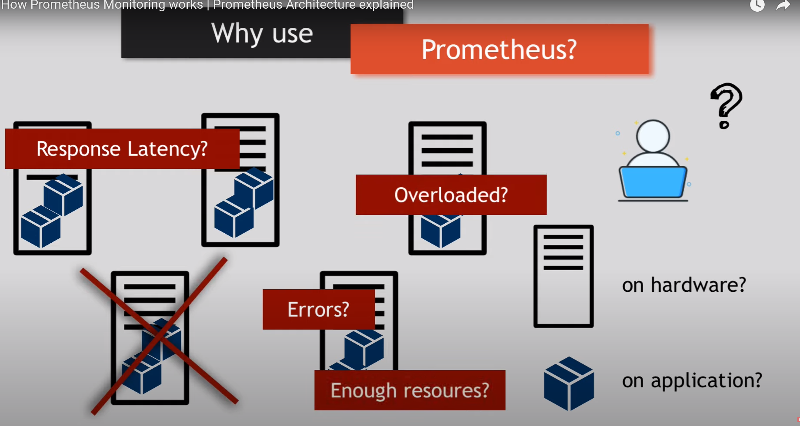
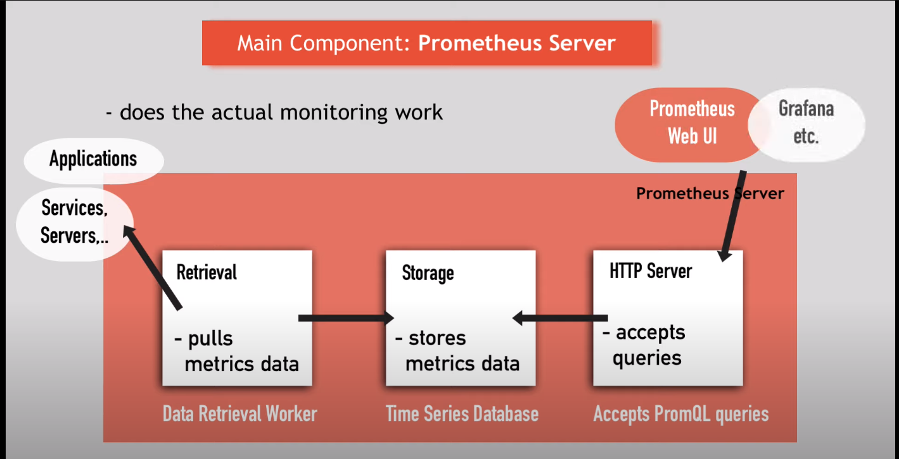

[note_source](https://www.youtube.com/watch?v=h4Sl21AKiDg&ab_channel=TechWorldwithNana)
# Introduction 

Prometheus is a popular open source monitoring and alerting toolkit. 

* A monitoring tool 
* Used to monitor highly dynamic container environments like docker-swarm, Kubernetes etc. 
* Also can use traditional non-container infrastructure 
* Most popular tool in container and microservice infrastructure.  

## Why Prometheus? 

As DevOps becomes more and more complex, it is tough to handle/maintain manually. So it needs more automation. Suppose there are separate containerized app running on multiple servers. As they are interconnected, 100s of interconnected processes are running simultaneously. So it's a challenge to maintain all of them without application downtime. There can be many servers located in different areas. So, there could be lots of error happening including:  

* Hardware error 
* Response latency 
* Memory overloaded in any server pc 
* Disk overloaded problem etc. 

So without any crash happening, maintaining them and debugging them manually is too tough. In this case Prometheus is a rescuer. 

## Some Scenario for the use case of Prometheus 

**#scenario1:** suppose we have stopped checking logs because the Elasticsearch doesn't accept any logs because there is no disk space available. 

==> Prometheus will check available space vs consumption 

 ---

**#scenraio2:** suppose, our app has been slow down because a service breaks down and it keeps sending hundreds of error message in a loop across the network. As a result, a high network traffic has created and it slows down the other services. 

==> as the monitoring tool Prometheus monitors network loads and it will tell which services are creating traffic. 

 ---

## Prometheus monitoring 

* constantly monitors all the services. 
* Alerts when crash 
* Identify problems before occur 
* Regularly checks each servers memory usage. Like if any server's memory percentage spikes 70% and continuously increasing, it will notify the administrator. 

## How Prometheus Work? Prometheus Architecture: 

### Prometheus Server 

In the core the main component of Prometheus is called the Prometheus server which does the actual monitoring works. It has 3 parts: 

1. ***Time Series Database*** that stores all the metrics data like current CPU usage, # of exceptions,  

2. ***Data Retrieval Worker*** that is responsible for getting and pulling those metrics from applications, services servers etc. other targeted resources and then pushing/storing them in the Time series database 

3. ***Web-server/server API*** that accepts queries for that stored data. And then server API is used to display data in a dashboard or UI either Prometheus web UI or other tools like **Grafana** 

### Targets and Metrics  

So Prometheus monitors a particular thing. It could be a linux server, apache server, single-applications, services like database. Those things that Prometheus monitors are called target.  

Each targets have units of monitoring. These units are called **Metrics** 

 
Targets ==> Monitoring  units (Metrics)  

Linux server ==> CPU status, Memory/Disk space usage 

Application ==> Exceptions count, Request Count, Request Duration 
 
***Metrics are saved into Prometheus Database component*** 

### How does Prometheus collect those metrics from targets? ###

* Prometheus pulls metrics data from targets from a HTTP endpoints which is by-default hostaddress/metrics 
* But the target must expose the /metrics endpoint. 
* Data in the /metrics endpoint must be in the correct format that Prometheus receives. 

---

**To monitor servers:**  

Some servers already exposes Prometheus endpoints where we don't need to add any component to get /metrics endpoint. But many services need another component which is called Exporter. It is basically a script of a service that 1. fetches metrics from target 2. converts them to correct format 3. expose /metrics where Prometheus can scrape them. Prometheus has a list of exporters for different services. We can go to the website and check them out. 

 

Monitor a Linux server, we have to:  

1. Download a node exporter tar file from Prometheus repository 

2. untar and execute 

3. Converts metrics of the server 

4. Exposes /metrics endpoint  

5. Configure Prometheus to scrape this endpoint  

 
**To monitor applications:**  

If we want to monitor our apps like: 

* How many requests? 
* How many exceptions? 
* How many server resources are used? 

Prometheus have client libraries with different languages (Go, Java, Python, Ruby)  We can expose /metrics endpoints from those libraries.  