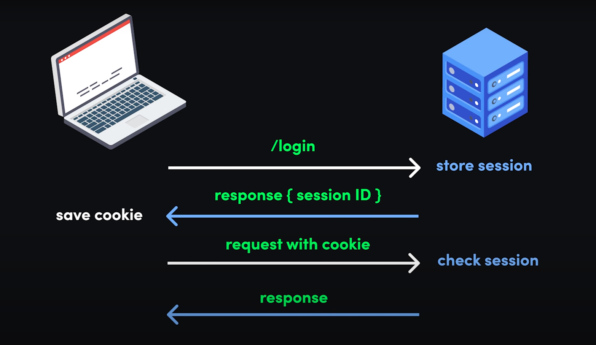

# Session vs JWT (basics)

This note is from this [video](https://www.youtube.com/watch?v=UBUNrFtufWo&ab_channel=Fireship), which is super helpful 

User Authentication == > There are 2 ways: **sessions** & **tokens** 

## Traditional approach ==> cookie based server side login 

1. User submits login form 

2. Server stores a session in the database and response with a session ID 

3. The session ID is saved in the browser cookie-jar ( a place in the browser to save key-value pairs). This cookie will be send on each request 

4. Browser sends cookies with future requests 

### Drawbacks of Traditional Approach: 
 
* Vulnerable to CSRF attack >> **Cross Site Request Forgery** >>  attackers performs some actions to a site of logged in users that users don't intend to do like /changePassword, submitting payment
modern frameworks(django...) though handle them   

* Session ID need to store in a database or server's memory. As most of the cloud based apps are scaled horizontally...it's a great issue

## Token Based Authentication 

Token based authentication solves this storage related problems 

### Mechanism/Process-flow: 

1. User submits login form  

2. Instead of creating a session ID servers creates JWT with a private key on the server and sends back to browser/client 

3. Browser puts JWT in local storage 

4. On future request JWT will be added to the authorization-header prefixed by Bearer 

5. Signed JWT header validated on future requests. Server just need to validate the signature. There is no need for database lookup in the structure. This is more efficient dealing with a distributed system in the cloud. 

### Drawbacks/Limits of Token based authentication: 

* Tokens can still be hijacked 

* They are difficult to invalidate  

* They can't be used to authenticate a user in the background on the server.  

| **Session** | **Token** |
| :---: | :---: |
| With a session, the authenticate state is handled on the server.  | Tokens are managed on the client. | 

