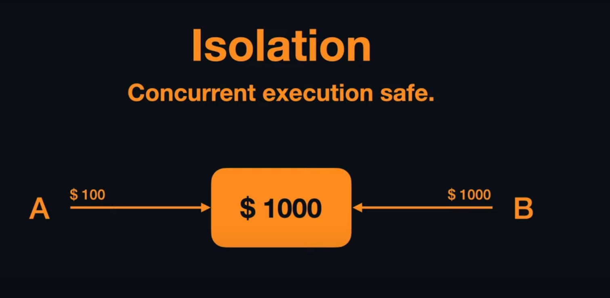

# Database Fundamentals
## Transaction and ACID properties of a transaction
[source_youtube_video](https://www.youtube.com/watch?v=yaQ5YMWkxq4&ab_channel=theroadmap)


**Program** : A set of instructions. It can either change or not change the database

**Transaction** : To call a program transaction, the database must be affected.

A transaction follows the ACID properties.
1. Atomicity
2. Consistency
3. Isolation
4. Durability

1. Atomicity: Without completing the full transaction, (commit happening), the database always rollback where it was started.

Suppose, the task is to read a value and then add some and then print the value. 

```
read(A)
A := A + 50
write(A)
```

2. Consistency :  
The database should help achieving the correct data state.
How does database do that?
It makes sure that all the constraints that we have set for our data must be followed.
 
 
 ```
Suppose we defined a column giving the constraint >> amounts must be postive... So database will always make sure that all the records are postive. and this rule is follwed -->> this is the consistency property.
```

3. Isolation : Isolation is mainly about the concurrency control. It mainly focuses on how database performs when the concurrent execution. 

Suppose 


we have a cuncurrent case like the picture that from the main account A and B both requests for this 100 and 1000 dollar. But if both transaction executes, the consistency property will not be obtained. The main account has to have $1100 to execute both operations.

Isolation sequentially handles this situation. It gives either A or B the required money and then updates the main account. So, when the other one comes for the money it get rejected, as there is no money in the main account. So, it stops the transaction.
It performs the sequential operations.

Now if the write operations failed somehow, the value of A will not be changed, it will return back to the initial stage. This is the atomicity property of a transaction.


## Delete vs Truncate command

| delete | truncate |
| --- | --- |
| DML command | DDL command |
| output is how many rows that it has deleted | used to delete the complete data without deleting the table structure.
| can use the `where` clause | **cannot use**, that means we cannot filter anything | 
| once delete command has used there is no way of recovering data `(cannot roll back)`, we have to keep backup | when truncate is executed SQL server doesn't delete data but only deallocates pages, so there is possibility of recovering the data.

